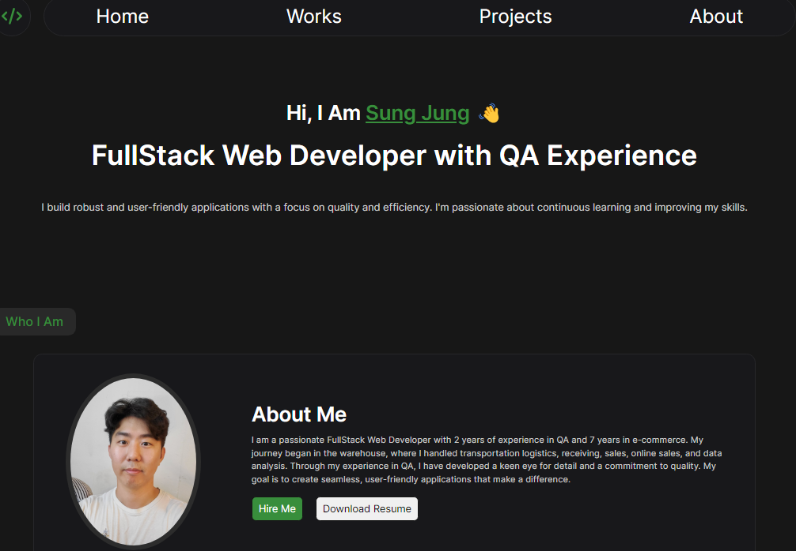
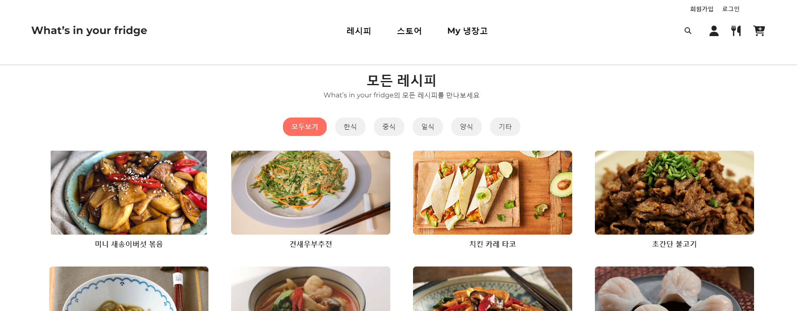
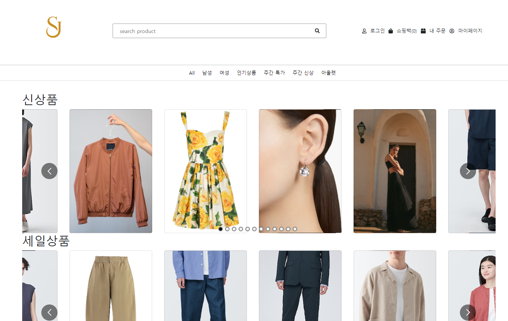
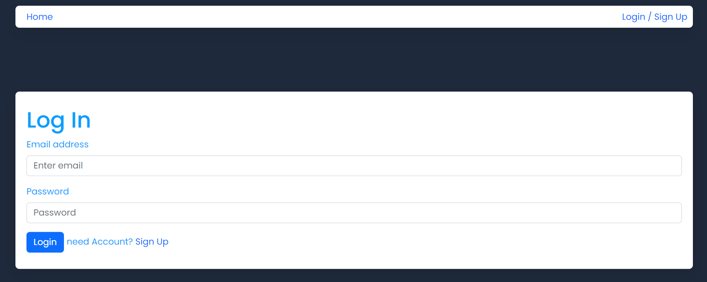
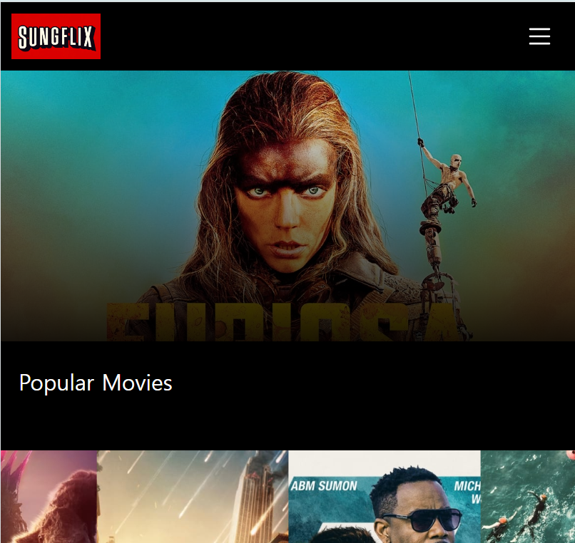
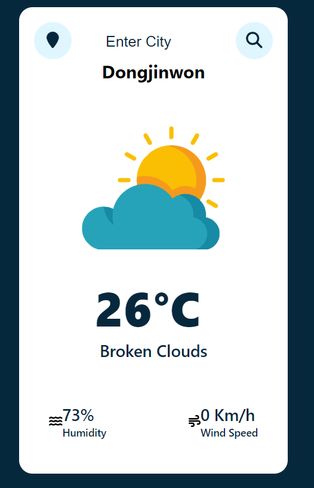
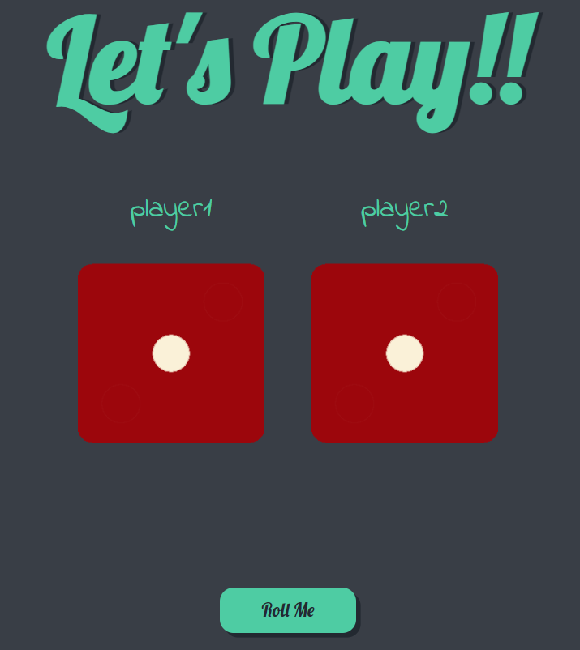
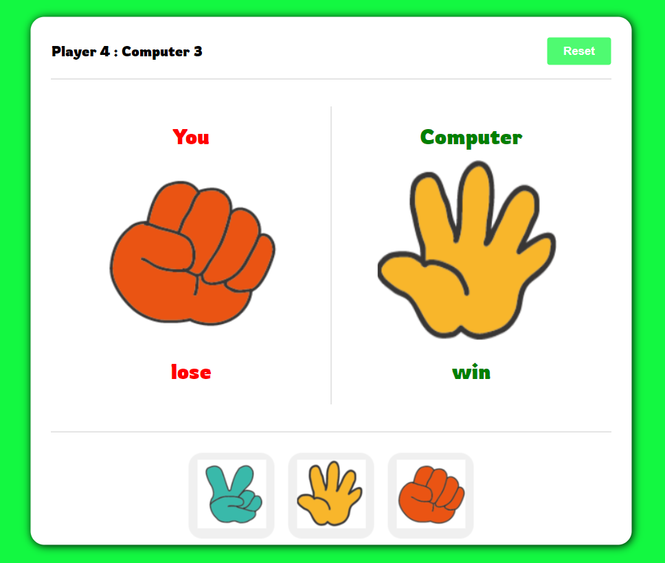
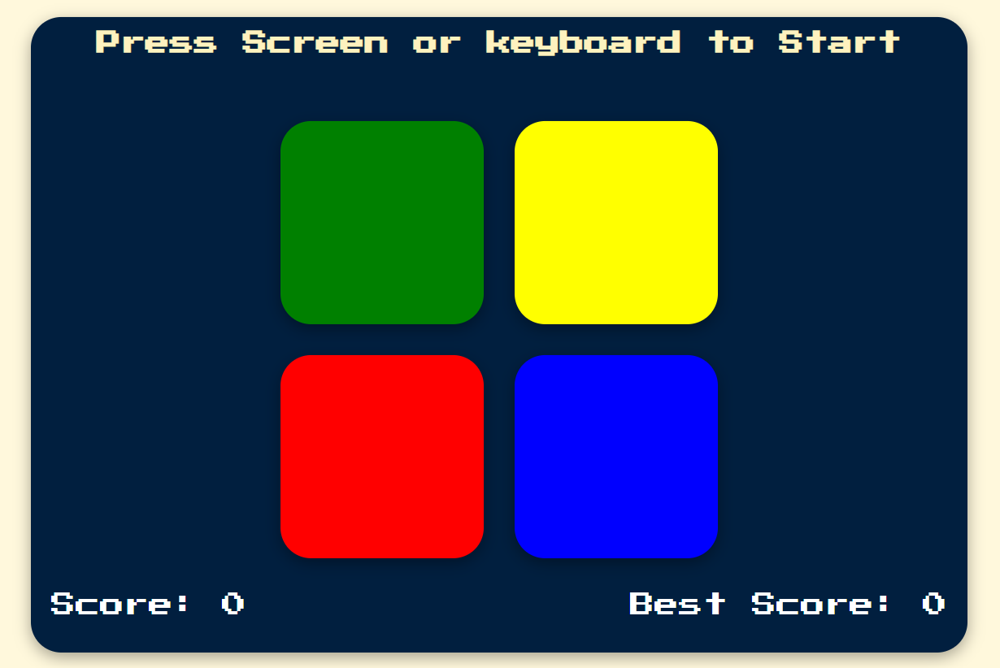

# My Portfolio 📂

A personal portfolio site showcasing my projects and skills. The site is built using JavaScript, React, and CSS, and features a collection of my recent work, including both individual and group projects.

 

## Developer

|  |
| :----------------------------------------------------------------------------------------: |
|              Sung U Jung [@SungJung0616](https://github.com/SungJung0616)              |

 

## Deployment Address

[My Portfolio](https://sj-personalportfolio.netlify.app/)

## Stacks

### Environment

 

### Config

### Development

  

### Deployment

 

## Features

### JavaScript Utilization

- Interactive elements such as forms and buttons for better user experience.

### React Utilization

- Components are designed and organized for reusability and manageability.
- Props to pass state values for rendering components.

### CSS Utilization

- The design and responsive work are done using CSS for a visually appealing interface.
- Animations and styles to enhance user experience.

## Projects

### Group Projects

1. **What's in your fridge (Frontend), (Backend)**
    - Description: What’s in your fridge is a website where users can browse various recipes and easily purchase the necessary ingredients.
    - [GitHub](https://github.com/SungJung0616/cooking-recipe-fe/tree/master)
    - [Live Site](https://whats-is-your-fridge.netlify.app/)
    - 

### Individual Projects

1. **SJ Shopping Mall (Frontend, Backend)**
    - Description: SJ is a website where users can conveniently purchase a variety of clothes.
    - [GitHub](https://github.com/SungJung0616/shoppin-mall-fe)
    - [Live Site](https://sj-shopping-mall.netlify.app/)
    - 

2. **ToDo App (Frontend, Backend)**
    - Description: A Todo List application built using JavaScript, React, Bootstrap, and CSS. This application allows users to register, log in, and manage their tasks efficiently. Users can add, edit, delete, and filter tasks, with tasks being stored securely on the backend.
    - [GitHub](https://github.com/SungJung0616/toDo-fe)
    - [Live Site](https://sj-todo-demo.netlify.app/)
    - 

3. **Netflix Demo**
    - Description: SUNGFLIX is a website where you can view various movie information at a glance.
    - [GitHub](https://github.com/SungJung0616/netflix-demo)
    - [Live Site](https://sj-sungflix-demo.netlify.app/)
    - 

4. **City Weather App**
    - Description: A Weather App project created using JavaScript, React, and CSS. The app fetches weather data for the user's current location or a searched city and displays the current weather conditions, including temperature, humidity, and wind speed.
    - [GitHub](https://github.com/SungJung0616/cityweatherapp)
    - [Live Site](https://sj-cityweatherapp.netlify.app/)
    - 

5. **Dice Game**
    - Description: A game project called Dice Game made using JavaScript, React, and CSS. Two players roll dice and compete to see who gets the higher number. The player with the higher number wins, and the game can be replayed as many times as desired.
    - [GitHub](https://github.com/SungJung0616/diceGame)
    - [Live Site](https://sj-diceplay.netlify.app/)
    - 

6. **Hand Battle**
    - Description: A game project called Hand Battle made using JavaScript, React, and CSS. It follows the same rules as the classic Rock, Paper, Scissors game. Users can select one of the items (Rock, Paper, Scissors), and the computer randomly selects one item. The outcome can be Win, Lose, or Tie. If the result is Win, the user scores 1 point. Scores can be reset at any time using the Reset button.
    - [GitHub](https://github.com/SungJung0616/handbattle)
    - [Live Site](https://sj-handbattle.netlify.app/)
    - 

7. **Simon Game**
    - Description: A game project called Simon Game made using JavaScript, React, and CSS. The game follows the classic Simon Game rules where users need to memorize and replicate the sequence of colors displayed. The game gets progressively more challenging as the sequence grows longer. The score increases with each level, and players can track their best score.
    - [GitHub](https://github.com/SungJung0616/simongameapp)
    - [Live Site](https://sj-simongame.netlify.app/)
    - 
